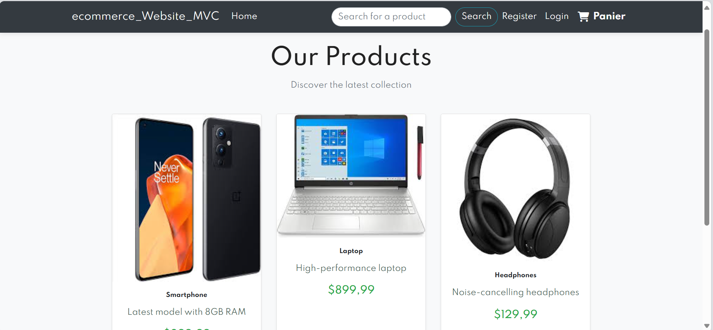
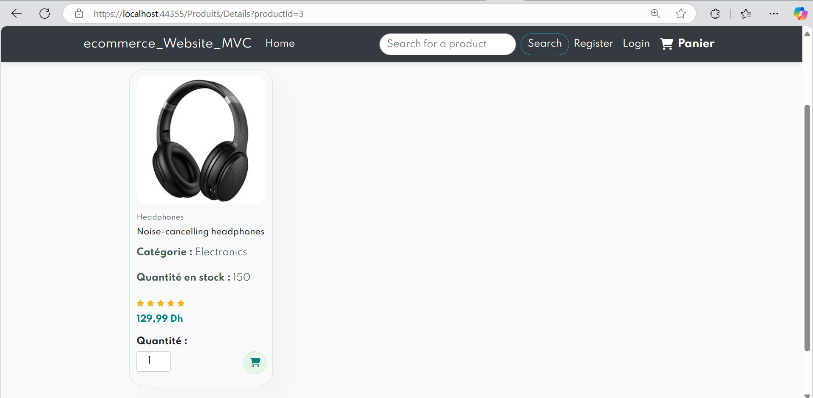
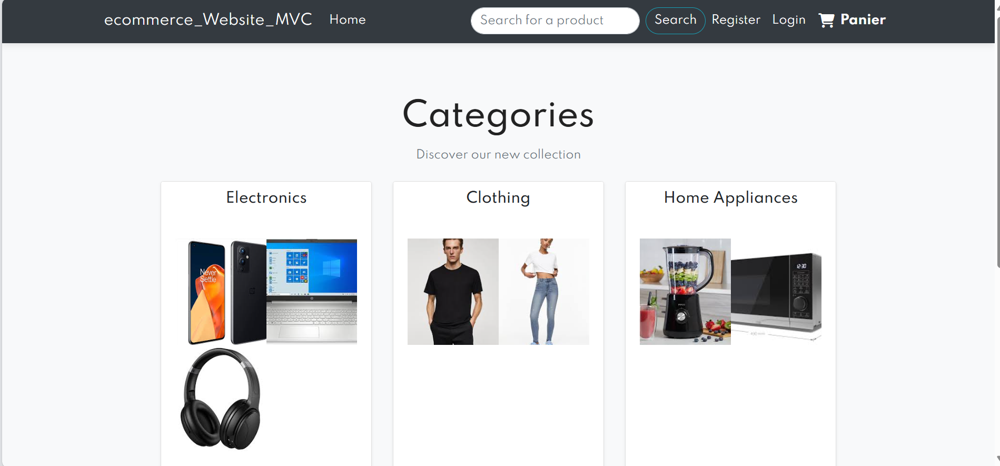
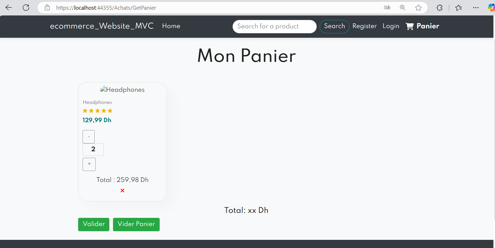
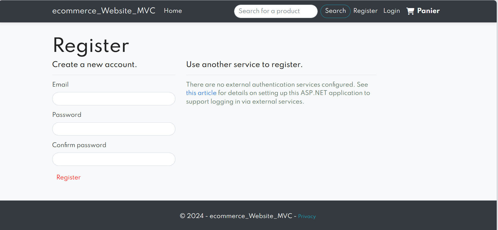

# Ecommerce MVC

This is an e-commerce web application built using the **ASP.NET Core MVC** framework. The project includes features for managing products, handling user authentication, and managing a shopping cart.

## Features

- **Products**:  
  Users can view a list of available products with their details (name, price, description, etc.).

  

- **Product Details**:  
  Users can view detailed information about each product.

  

- **Categories**:  
  Users can browse products by category.

  

- **Shopping Cart Management**:  
  Users can add products to the shopping cart, update quantities, and remove items.

  

- **User Authentication**:  
  Users can register, log in, and log out. Authentication is implemented using **ASP.NET Identity**.

  

## Technologies Used

- **ASP.NET Core MVC** for backend and frontend.
- **Entity Framework Core** for database interaction.
- **SQL Server** for database management.
- **ASP.NET Identity** for user authentication and authorization.
- **Bootstrap** for responsive UI design.

## Packages Used

- **Microsoft.AspNetCore.Identity.EntityFrameworkCore (5.0.17)**  
  Provides ASP.NET Core Identity with Entity Framework Core for user management.

- **Microsoft.AspNetCore.Identity.UI (5.0.17)**  
  Provides pre-built UI pages for ASP.NET Core Identity.

- **Microsoft.EntityFrameworkCore.SqlServer (5.0.17)**  
  SQL Server provider for Entity Framework Core.

- **Microsoft.EntityFrameworkCore.Tools (5.0.17)**  
  Tools for creating and applying migrations.

- **Microsoft.VisualStudio.Web.CodeGeneration.Design (5.0.2)**  
  Code generation tools for controllers, views, and other components.

## How to Run the Project

1. Clone the repository:
   ```bash
   git clone https://github.com/Ouissal0/Ecommerce_MVC.git
